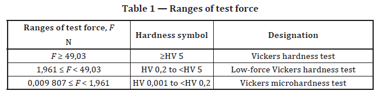
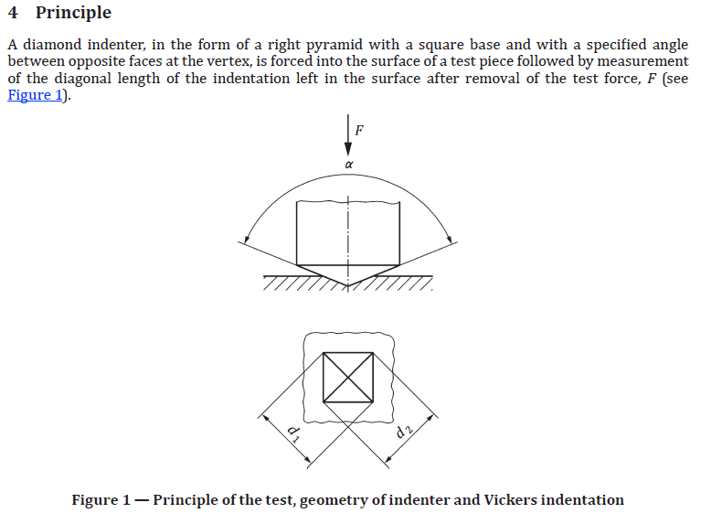
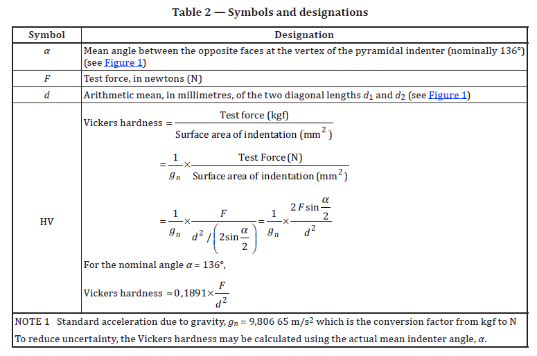
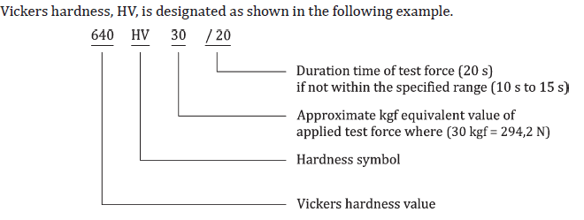
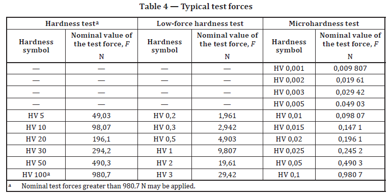
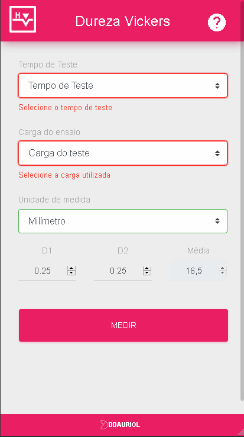

  
# HVEasy - Calculardo de dureza Vickers (Vickers hardness calc)

  
## Descrição do cálculo:
Dureza Vickers é um método de classificação da dureza dos materiais baseada num ensaio laboratorial. Neste método, é usada uma pirâmide de diamante com ângulo de diedro de 136º que é comprimida, com uma força arbitrária "F", contra a superfície do material. Calcula-se a área "A" da superfície impressa pela medição das suas diagonais. [Wiki](https://pt.wikipedia.org/wiki/Dureza_Vickers)
  
A dureza Vickers HV é dada por (*EN ISO 6507-1:2018*):  
  
_Tipo de ensaios_  

_Conceito_  

_Calculo_  

_Designação_  

_Forças Totais_  

  
## Tecnologias Utilziadas
**Tecnologia:** JS / HTML / CSS / Cordova
  
## Lista de funcionalidades
- [x] Cálculos baseados nas diagonais
- [x] Conversão para GPA e MPA
- [ ] Cáculo de médias acumuladas
- [ ] Exportar dados em CSV
- [ ] Cálculo reverso
  
## Versão BETA

